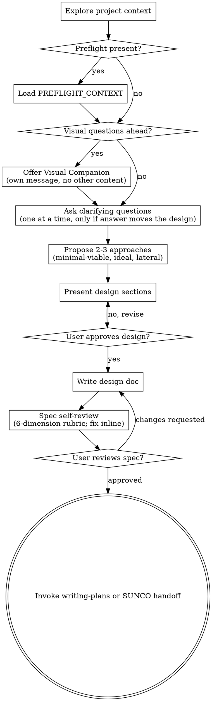

# Brainstorming Ideas Into Designs

Help turn ideas into fully formed designs and specs through natural collaborative dialogue.

Start by understanding the current project context, then ask questions one at a time to refine the idea. Once you understand what you're building, present the design and get user approval.

<HARD-GATE>
Do NOT invoke any implementation skill, write any code, scaffold any project, or take any implementation action until you have presented a design and the user has approved it. This applies to EVERY project regardless of perceived simplicity.

Explicitly forbidden during brainstorming:

- `/sunco:execute`, `/sunco:quick`, `/sunco:fast` (implementation)
- `/sunco:ship`, `/sunco:release`, `/sunco:land` (delivery)
- `/sunco:test-gen`, `/sunco:verify`, `/sunco:review` (post-implementation gates)
- `writing-plans`, `executing-plans`, `test-driven-development` (Superpowers implementation skills)

The ONLY allowed next steps from brainstorming are: continue clarifying, write/revise the spec, or hand off to the terminal state declared in this skill's frontmatter.
</HARD-GATE>

## Anti-Pattern: "This Is Too Simple To Need A Design"

Every project goes through this process. A todo list, a single-function utility, a config change — all of them. "Simple" projects are where unexamined assumptions cause the most wasted work. The design can be short (a few sentences for truly simple projects), but you MUST present it and get approval.

## [SUNCO+] Preflight Awareness

When this skill runs inside the SUNCO chain (office-hours → brainstorming → new), a `PREFLIGHT_CONTEXT` block is provided by the caller. It contains the idea, office-hours diagnostic (goal, demand evidence, status quo, user, wedge, risks), any prior design work, and open assumptions.

Rules when preflight context is present:

1. **Do not restart ideation.** Treat preflight as already-answered questions. Re-asking what office-hours already extracted is the #1 failure mode here.
2. **Cite preflight in the design.** Every constraint, user, or scope decision that traces back to office-hours must be labeled `[from office-hours]` in the written spec so later readers can see the evidence chain.
3. **Re-challenge only what stayed vague.** If office-hours produced "engineers" instead of a specific user, that is a follow-up question worth asking. If office-hours produced a named first user, do not re-ask.
4. **Contradictions are a stop condition.** If the user's answers here contradict office-hours findings, pause, surface the contradiction, and ask which version is the new source of truth. Do not silently overwrite the preflight.

If no `PREFLIGHT_CONTEXT` is provided, behave as a standalone Superpowers brainstorming session.

## Checklist

You MUST create a task for each of these items and complete them in order:

1. **Explore project context** — check files, docs, recent commits
2. **[SUNCO+] Load preflight context** — if invoked after office-hours, read and reuse the PREFLIGHT_CONTEXT block instead of restarting
3. **Offer visual companion** (if topic will involve visual questions) — this is its own message, not combined with a clarifying question. See the Visual Companion section below.
4. **Ask clarifying questions** — one at a time, understand purpose/constraints/success criteria; answers must change the design, otherwise the question is waste
5. **Propose 2-3 approaches** — with trade-offs, recommended option, and one must be minimal-viable, one ideal, one lateral/creative
6. **Present design** — in sections scaled to their complexity, get user approval after each section
7. **Write design doc** — save to `docs/superpowers/specs/YYYY-MM-DD-<topic>-design.md` and commit
8. **Spec self-review** — 6-dimension rubric (completeness, consistency, clarity, scope, feasibility, YAGNI); fix inline
9. **User reviews written spec** — ask user to review the spec file before proceeding
10. **Transition to the terminal state** — invoke writing-plans, OR the SUNCO handoff `/sunco:new --from-preflight <spec-path>` when `sunco-terminal-state` is set in this skill's frontmatter

## Process Flow



**Terminal state selection:**

- Default Superpowers terminal state is invoking `writing-plans`.
- When the frontmatter `sunco-terminal-state` is set (as it is in this vendored copy), the terminal state becomes `/sunco:new --from-preflight <spec-path>` instead, so the approved spec flows into SUNCO's planning artifacts (PROJECT.md, REQUIREMENTS.md, ROADMAP.md) rather than a Superpowers implementation plan.
- Do NOT invoke frontend-design, mcp-builder, or any other implementation skill from brainstorming.

## The Process

**Understanding the idea:**

- Check out the current project state first (files, docs, recent commits)
- Before asking detailed questions, assess scope: if the request describes multiple independent subsystems (e.g., "build a platform with chat, file storage, billing, and analytics"), flag this immediately. Don't spend questions refining details of a project that needs to be decomposed first.
- If the project is too large for a single spec, help the user decompose into sub-projects: what are the independent pieces, how do they relate, what order should they be built? Then brainstorm the first sub-project through the normal design flow. Each sub-project gets its own spec → plan → implementation cycle.
- For appropriately-scoped projects, ask questions one at a time to refine the idea
- Prefer multiple choice questions when possible, but open-ended is fine too
- Only one question per message - if a topic needs more exploration, break it into multiple questions
- Focus on understanding: purpose, constraints, success criteria

**[SUNCO+] The question economy:**

- Ask only questions whose answers change the design. If every possible answer leads to the same architecture, skip the question.
- Do not re-ask what `PREFLIGHT_CONTEXT` already answered. Surface preflight facts as premises to confirm ("Office hours said your first user is <NAME>. Still true?") instead of re-interviewing.
- A premise confirmation counts as a question. Two premise confirmations in a row that are accepted without change is signal to move on.
- Cap total new questions at 5 when preflight context is present and 8 otherwise. More than that usually means the design is stuck on vague user intent, not on missing facts.

**Exploring approaches:**

- Propose 2-3 different approaches with trade-offs
- Present options conversationally with your recommendation and reasoning
- Lead with your recommended option and explain why
- **[SUNCO+] Coverage rubric:** the set of approaches must include at least two of these three roles:
  - **Minimal viable** — smallest diff, ships fastest, acceptable to ship as v1 even if thin
  - **Ideal architecture** — best long-term trajectory, honest about cost
  - **Lateral / creative** — reframes the problem or uses an unexpected primitive
- For each approach include: effort (S / M / L / XL), risk (Low / Med / High), what it intentionally does NOT do (YAGNI line)

**Presenting the design:**

- Once you believe you understand what you're building, present the design
- Scale each section to its complexity: a few sentences if straightforward, up to 200-300 words if nuanced
- Ask after each section whether it looks right so far
- Cover: architecture, components, data flow, error handling, testing
- Be ready to go back and clarify if something doesn't make sense
- **[SUNCO+] Every design must include an "Out of scope (explicit)" section.** A design that cannot list what it refuses to do has not decided yet.

**Design for isolation and clarity:**

- Break the system into smaller units that each have one clear purpose, communicate through well-defined interfaces, and can be understood and tested independently
- For each unit, you should be able to answer: what does it do, how do you use it, and what does it depend on?
- Can someone understand what a unit does without reading its internals? Can you change the internals without breaking consumers? If not, the boundaries need work.
- Smaller, well-bounded units are also easier for you to work with - you reason better about code you can hold in context at once, and your edits are more reliable when files are focused. When a file grows large, that's often a signal that it's doing too much.

**Working in existing codebases:**

- Explore the current structure before proposing changes. Follow existing patterns.
- Where existing code has problems that affect the work (e.g., a file that's grown too large, unclear boundaries, tangled responsibilities), include targeted improvements as part of the design - the way a good developer improves code they're working in.
- Don't propose unrelated refactoring. Stay focused on what serves the current goal.

## After the Design

**Documentation:**

- Write the validated design (spec) to `docs/superpowers/specs/YYYY-MM-DD-<topic>-design.md`
  - (User preferences for spec location override this default)
- Use elements-of-style:writing-clearly-and-concisely skill if available
- Commit the design document to git
- **[SUNCO+] Required spec sections (scale to complexity, but all must exist):**
  1. Problem statement
  2. Evidence (`[from office-hours]` where applicable)
  3. Target user (specific, named if possible)
  4. Narrowest wedge (v1 slice)
  5. Approach chosen, with the discarded approaches preserved as a short comparison table
  6. Out of scope (explicit)
  7. Risks and assumptions
  8. Success criteria (testable)
  9. Traceability table: every v1 requirement → source (office-hours / brainstorming / user directive)

**Spec Self-Review — [SUNCO+] 6-Dimension Rubric:**

After writing the spec document, look at it with fresh eyes and score each dimension 1-10. Any dimension < 7 must be fixed before moving on.

| Dimension | What it asks | Fail signal |
|---|---|---|
| Completeness | Are all required sections present and filled? | "TBD", "TODO", empty sections |
| Consistency | Do sections agree with each other? | Architecture says X, features assume Y |
| Clarity | Could any requirement be read two different ways? | Vague verbs ("handle", "support") without definition |
| Scope | Can this be delivered by a single plan? | Multiple independent subsystems still mixed in |
| Feasibility | Is the chosen approach realistically shippable under the stated constraints? | Hand-wavy "we'll figure it out" sections |
| YAGNI | Does every listed feature earn its place? | Hypothetical future needs, speculative abstractions |

Fix any failure inline. No need to re-review after fixes — just fix and move on. Do not score and move on without fixing; a low score that is written down but not acted on is worse than not scoring.

**User Review Gate:**

After the spec review loop passes, ask the user to review the written spec before proceeding:

> "Spec written and committed to `<path>`. Please review it and let me know if you want to make any changes before we start writing out the implementation plan."

Wait for the user's response. If they request changes, make them and re-run the spec review loop. Only proceed once the user approves.

**Implementation handoff:**

- Default Superpowers: invoke the `writing-plans` skill to create a detailed implementation plan.
- **[SUNCO+] When `sunco-terminal-state` is set** (as in this vendored copy): do NOT invoke `writing-plans`. Instead, hand off with:

  ```text
  /sunco:new --from-preflight <path-to-approved-spec>
  ```

  The SUNCO `new` skill will read the approved spec as primary source material and generate `.planning/PROJECT.md`, `.planning/REQUIREMENTS.md`, and `.planning/ROADMAP.md` without restarting ideation.

- Do NOT invoke any other skill from brainstorming.

## Key Principles

- **One question at a time** — Don't overwhelm with multiple questions
- **Multiple choice preferred** — Easier to answer than open-ended when possible
- **YAGNI ruthlessly** — Remove unnecessary features from all designs
- **Explore alternatives** — Always propose 2-3 approaches before settling
- **Incremental validation** — Present design, get approval before moving on
- **Be flexible** — Go back and clarify when something doesn't make sense
- **[SUNCO+] Questions must change outcomes** — If the answer doesn't alter the design, skip the question
- **[SUNCO+] Name the discarded approach** — The design is stronger when the reader can see what was rejected and why
- **[SUNCO+] Evidence wins arguments** — A requirement backed by an office-hours observation beats a requirement backed by author preference

## Visual Companion

A browser-based companion for showing mockups, diagrams, and visual options during brainstorming. Available as a tool — not a mode. Accepting the companion means it's available for questions that benefit from visual treatment; it does NOT mean every question goes through the browser.

**Offering the companion:** When you anticipate that upcoming questions will involve visual content (mockups, layouts, diagrams), offer it once for consent:
> "Some of what we're working on might be easier to explain if I can show it to you in a web browser. I can put together mockups, diagrams, comparisons, and other visuals as we go. This feature is still new and can be token-intensive. Want to try it? (Requires opening a local URL)"

**This offer MUST be its own message.** Do not combine it with clarifying questions, context summaries, or any other content. The message should contain ONLY the offer above and nothing else. Wait for the user's response before continuing. If they decline, proceed with text-only brainstorming.

**Per-question decision:** Even after the user accepts, decide FOR EACH QUESTION whether to use the browser or the terminal. The test: **would the user understand this better by seeing it than reading it?**

- **Use the browser** for content that IS visual — mockups, wireframes, layout comparisons, architecture diagrams, side-by-side visual designs
- **Use the terminal** for content that is text — requirements questions, conceptual choices, tradeoff lists, A/B/C/D text options, scope decisions

A question about a UI topic is not automatically a visual question. "What does personality mean in this context?" is a conceptual question — use the terminal. "Which wizard layout works better?" is a visual question — use the browser.

If they agree to the companion, read the detailed guide before proceeding:
`skills/brainstorming/visual-companion.md`
